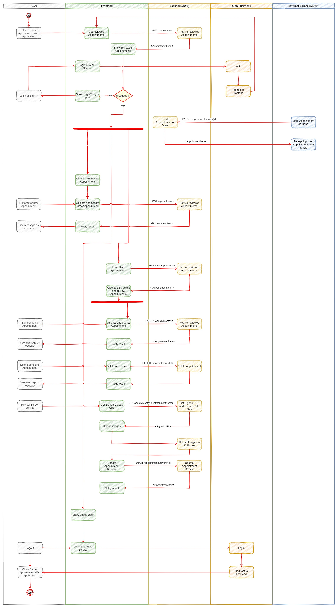

# Barber Appointments
Simple web application to make an appointment with barber. This repo contain two projects:
* __backend__: Nodejs application based on Serverless Framework to deploy lambda functions an related resources to AWS.
* __frontend__: Single page application (SPA) created with Angular to provide a Web user interface to Create, Update, Delete and Review a Barber Appointment.

## Backend


Nodejs project based on Serverless Framework.

### Requirement
* npm command
* node 12 or higher
* AWS CLI

### Deployment

1. Entry to "backend" folder path
```bash
cd backend
```

2. Install node dependencies
```bash
npm install
```

3. Configure AWS credentials
```bash
aws configure
```

4. Deploy to AWS using Serverless
```bash
npm run deploy
```

### API Testing
A Postman collection file was provided ([resources/barber-appointment.postman_collection.json](resources/barber-appointment.postman_collection.json)) to test Lambda functions.

### CI/CD
The automatization of build and deploy is managed by __GitHub Actions__ configured by main.yml file.

* The _backend-build_ Job is triggered by each push or pull request to _main_ branch.
* And _backend-deploy_ Job (AWS deploy) is triggered by relase tags.

#### Variables:

* AWS_DEPLOY_STAGE: AWS deploy stage (default as "dev")
* AWS_DEPLOY_REGION: AWS deploy region (default as "us-east-1")

#### Secrets:

* AWS_DEPLOY_ACCESS_KEY_ID: AIM User Access Key ID
* AWS_DEPLOY_SECRET_ACCESS_KEY: AIM User Secret Access Key

### Activity Diagram
A simple Activity Diagram was provided to understand all interactions between user and systems:



## Frontend

SPA based on Angular project

### Requirement
* npm command
* node 12 or higher

### Run
To run the web application locally:

1. Entry to "frontend" folder path
```bash
cd frontend
```

2. Update _src/environments/environment.ts_ file
```ts
const apiId = 'YOUR API ID FROM DEPLOYED AWS LAMBDA FUNCTIONS';
const region = 'YOUR AWS REGION WHERE IS DEPLOYED FRONTEND';
```

3. (Optional) Update Auth0 configurations at _src/environments/environment.ts_ file
```ts
auth0ClientId: 'YOUR Auth0 Client ID'
```

4. Run npm script to build and start local server
```bash
npm run start
```

5. Start your browser at http://localhost:4200

### CI

The automatization of build and testing is managed by __GitHub Actions__ configured by main.yml file. The _frontend-build_ and _frontend-test_ Job is triggered by each push or pull request to _main_ branch.

## How this work

